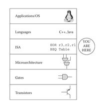

# **組合語言**
## **何謂組合語言**
>組合語言（Assembly Language）是一種低階程式語言，通常用於與計算機硬體進行交互的程式開發中。組合語言是一種對機器碼（機器語言）進行相對抽象的表示方式，使程序員能夠更容易地理解和編寫與特定硬體架構相關的指令。


## 組合語言架構 
fdfdff
##暫存器
dfdsf
## 組合語言的格式
* Label(標籤) Mnemonic(運算碼) Operand(運算元)  Comment(註解)


EX:

```
Loop:   MOV P1 , A 
        CALL Delay ;delay some time`
        RL A
        JUMP lOOP
delay:
```


## 定址模式: 

-  直接定址法
       ``` MOV A,10H ```
 -  間接定址法
### **UNION%STRUCT 的不同!(9/14上課內容)**
